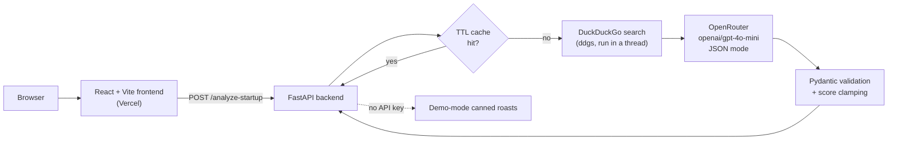

# 🗑️ Is My Startup Trash?

**Roast your startup idea before investors do.** Paste a pitch, and it searches the web for your competitors and returns a brutally honest verdict, a score, and one piece of advice worth hearing.


<p align="center">
  
  <br />
  <sub>Recorded locally in demo mode (no API key, canned roasts). With an OpenRouter key, every roast is generated live.</sub>
</p>

## Why this exists

Founders hear "interesting, keep us posted" far more often than the truth. This app gives the feedback polite people won't: *has this been built already, and by whom?* It grounds the roast in a real web search, so the jokes land on actual competitors instead of generic snark. Under the humour, it's a quick competitive-landscape check.

## What it does

- **Finds competitors**: two DuckDuckGo searches per idea (by description and by name), fed to the model as context.
- **Delivers a structured verdict**: `trash` / `potential` / `gold`, a 0–10 viability score, originality score, market-size read, execution difficulty, a name rating, and advice.
- **Stays cheap and fast**: in-memory TTL caches for search results (1 h, 100 entries) and AI responses (30 min, 50 entries), so repeated ideas cost nothing.
- **Works without a key**: if `OPENROUTER_API_KEY` is unset, the API runs in **demo mode** and returns canned example roasts.
- **Shareable**: one-click "Share on X" with the verdict and score.

## Architecture



The model is asked for strict JSON (`response_format: json_object`, temperature 1.2 for variety). The backend validates the reply against the `StartupAnalysis` Pydantic model and clamps scores to 0–10. If the LLM call fails, it returns a safe fallback verdict instead of a 500.

## Getting started

**Requirements:** Python 3.11+, Node 18+, and an [OpenRouter API key](https://openrouter.ai/keys) (optional; without one you get demo mode).

### Backend (port 8000)

```bash
cd backend
python -m venv venv && source venv/bin/activate   # Windows: venv\Scripts\activate
pip install -r requirements.txt
cp .env.example .env                              # then add your OPENROUTER_API_KEY
uvicorn app.main:app --reload --loop asyncio
```

Interactive API docs: <http://localhost:8000/docs>

> `--loop asyncio` matters: the search library doesn't play well with uvloop.

### Frontend (port 3000)

```bash
cd frontend
npm install
npm run dev
```

Open <http://localhost:3000>. The frontend calls `http://localhost:8000` by default. Set `VITE_API_URL` (see `frontend/.env.example`) to point it elsewhere.

### Environment variables

| Variable | Where | Default | Purpose |
|---|---|---|---|
| `OPENROUTER_API_KEY` | backend | *(unset → demo mode)* | LLM access via OpenRouter |
| `ALLOWED_ORIGINS` | backend | `http://localhost:3000,http://localhost:5173` | Comma-separated CORS origins |
| `VITE_API_URL` | frontend | `http://localhost:8000` | Backend base URL |

## Usage

```bash
curl -X POST http://localhost:8000/analyze-startup \
  -H "Content-Type: application/json" \
  -d '{"name": "Uber for Dogs", "description": "On-demand dog walking app"}'
```

```json
{
  "verdict": "trash",
  "roast": "There are literally 47 dog walking apps fighting for the same suburban moms...",
  "competitors": ["Rover", "Wag", "Barkly", "PetBacker", "Care.com"],
  "score": 2.5,
  "name_rating": "Cringe - 'Uber for X' naming died in 2015",
  "advice": "Consider a specific niche like luxury pet concierge or pet medical transport instead.",
  "market_size": "Saturated - $1.2B market with 50+ established players",
  "originality_score": 1.5,
  "execution_difficulty": "Medium - Standard two-sided marketplace"
}
```

| Endpoint | Method | Description |
|---|---|---|
| `/` | GET | Health check |
| `/health` | GET | `healthy`, or `degraded` when running in demo mode |
| `/analyze-startup` | POST | Search + roast. Body: `name` (1–100 chars), `description` (10–1000 chars) |
| `/random-example` | GET | A random example idea (powers the 🎲 button) |
| `/examples` | GET | Three random example roasts |
| `/docs`, `/redoc` | GET | OpenAPI docs |

## Deployment

- **Frontend**: Vercel, root directory `frontend/`. `frontend/vercel.json` adds an SPA rewrite and security headers.
- **Backend**: any host that runs a Procfile or Nixpacks (`backend/Procfile`, `backend/railway.json`). Start command: `uvicorn app.main:app --host 0.0.0.0 --port $PORT --loop asyncio`.

**Status:** the frontend is deployed at [is-my-startup-trash.vercel.app](https://is-my-startup-trash.vercel.app). The API is moving to a new host, so live roasts are temporarily offline.

## Tech stack

Python · FastAPI · Pydantic v2 · OpenRouter (OpenAI SDK) · ddgs · React 18 · Vite · Tailwind CSS · Vercel Analytics

## Disclaimer

For entertainment (and mild enlightenment). Not responsible for crushed dreams, existential crises, or sudden pivots to crypto.

## License

[MIT](LICENSE) © [Enochthedev](https://github.com/Enochthedev)
